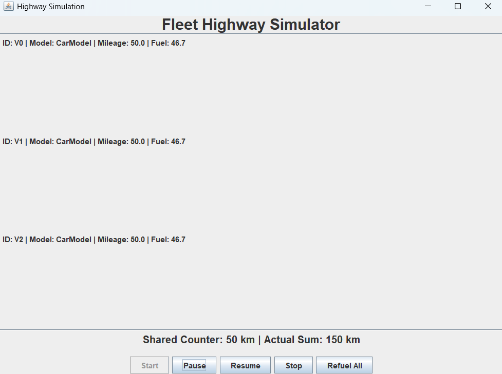
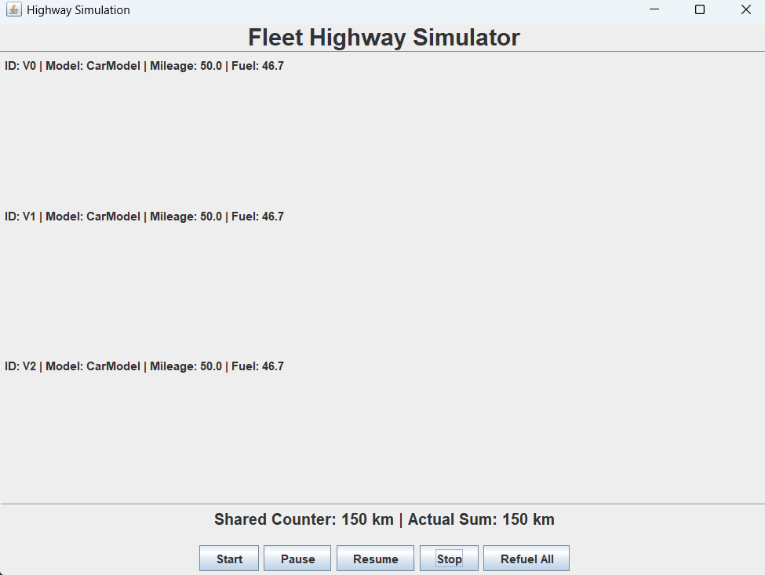

# Vehicle Fleet Management System

## Project Overview
This project is a console-based application built in Java to simulate a vehicle fleet management system. It showcases fundamental Object-Oriented Programming (OOP) concepts such as **inheritance**, **polymorphism**, and **abstraction**. The system allows for managing various types of vehicles, including land, water, and air vehicles, each with unique functionalities.

## Core OOP Principles
The code is structured to demonstrate several key object-oriented programming (OOP) principles:

* **Inheritance:** A multi-level class hierarchy is used, starting with the abstract Vehicle class. LandVehicle, AirVehicle, and WaterVehicle extend Vehicle, while concrete classes like Car and Truck extend LandVehicle. This structure allows for code reuse and a clear organizational model.

* **Polymorphism:** The system leverages polymorphism extensively. For example, the FleetManager's startAllJourneys() method can call the move() method on any Vehicle object in the fleet, and Java's dynamic method dispatch ensures that the correct, type-specific move() implementation is executed (e.g., "Driving on road..." for a Car, "Flying at..." for an Airplane).

* **Abstract Classes:** The Vehicle, LandVehicle, AirVehicle, and WaterVehicle classes are abstract. They define a common structure and behavior for all vehicles but leave specific implementations (like move() and calculateFuelEfficiency()) to their concrete subclasses.

* **Interfaces:** Interfaces like FuelConsumable, CargoCarrier, PassengerCarrier, and Maintainable are used to define modular behaviors. A class can implement multiple interfaces, allowing for a flexible design where, for example, a Bus can be both a PassengerCarrier and a CargoCarrier.

## Multithreading Demonstration

* **Without Race Condition Syncronisation** To show the incorrect behaviour, we will run the multithreaded program without any Reentrant Locks.
Since all the threads are accessing the shared counter together, it is not able to store the correct information and gives indeterminate output


* **With Race Condition Syncronisation** When we add lock before accessing the shared variable, only a single thread can access the shared variable at a time preventing any race conditions and giving us the correct deterministic output


## GUI
The graphical interface is built using Java Swing to provide a real-time dashboard for controlling the multithreaded simulation (Start, Pause, Stop, Refuel). It features a scrollable vehicle list for tracking individual progress and a status bar that displays both the Shared Highway Counter and the Actual Sum of mileages side-by-side. This layout allows users to visually verify the race condition by observing discrepancies between the two values when synchronization is disabled.


## Collections and Generics
The container was changed to a generic ArrayList<Vehicle> to provide dynamic resizing and ensure compile-time type safety while still allowing for polymorphic storage of all Vehicle subtypes.

## Features
* **Add/Remove Vehicles:** Add different types of vehicles (e.g., Cars, Trucks, Airplanes) to the fleet.
* **Refueling & Maintenance:** Manage fuel levels for all vehicles and perform maintenance on them.
* **Loading/Storing Data:** The application can load fleet data from a CSV file and save the current fleet status back to a file. A sample input file, `Example.csv`, is included to demonstrate this functionality.
* **Vehicle-Specific Operations:** Perform operations unique to certain vehicle types (e.g., loading cargo onto a truck, carrying passengers on a bus).
* **Generate Reports:** Create a detailed report of all vehicles in the fleet.

## UML Diagram
The following UML diagram illustrates the class structure and relationships within the project. It highlights the use of abstract classes (`Vehicle`), interfaces (`FuelConsumable`), and a clear inheritance hierarchy.


## How to Run
1.  **Clone the repository:**
    ```bash
    git clone https://github.com/RishabhGuptaGH/VehicleFleetManager.git
    ```

2.  ### Navigate and Compile
    Move into the project directory and compile all Java files:
    ```bash
    cd VehicleFleetManager
    javac -d bin -sourcepath src src\Execution\Main.java
    ```
    

3. ### Run the Program:
    ```bash
    java -cp bin Execution.Main
    ```

3.  ### Using IntelliJ IDEA
    1.  **Open the project:** In IntelliJ, go to `File` > `Open...` and select the `ASSIGNMENT1` folder. IntelliJ will automatically detect the project structure and configure it for you.
    2.  **Run the main class:** In the Project tool window on the left, navigate to `src/Execution/Main.java`. Right-click the file and select `Run 'Main.main()'` from the context menu. You can also click the green play button icon in the gutter next to the `main` method.


## File Structure
The project is organized into logical packages:
* `src/Exceptions`: Custom exception classes.
* `src/Execution`: Main application logic (`FleetManager`, `Main`).
* `src/Interfaces`: Defines the contracts for different vehicle behaviors.
* `src/Vehicles`: Contains the abstract and concrete vehicle classes.
* `Example.csv`: A sample CSV file used for loading fleet data.
* `UML Diagram.png`: The visual representation of the class structure.